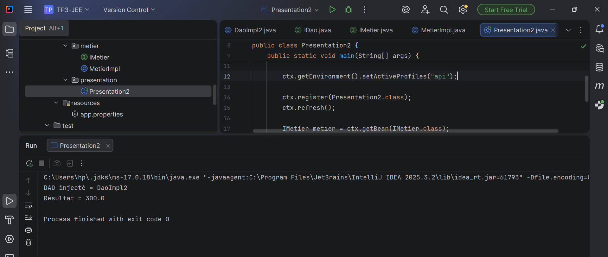
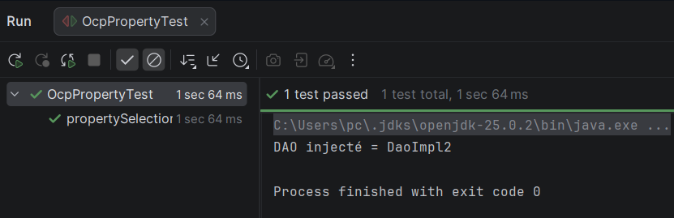
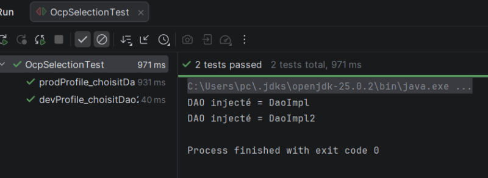

# Dependency Injection avec Spring – Sélection dynamique des implémentations DAO

Ce projet est une application **Java utilisant le framework Spring** permettant de démontrer le principe **d’injection de dépendances (Dependency Injection)** ainsi que le respect du **principe OCP (Open/Closed Principle)**.

L’objectif principal est de pouvoir **changer l’implémentation de la couche DAO uniquement via la configuration**, sans modifier la classe métier.

Le projet utilise plusieurs mécanismes du framework Spring pour sélectionner dynamiquement l’implémentation utilisée :

- **Spring Context** pour gérer les beans et l’injection de dépendances
- **Profils Spring (@Profile)** pour activer différentes implémentations selon l’environnement
- **@Primary** pour définir une implémentation par défaut
- **Alias de bean via une classe de configuration (@Bean)**
- **Fichier de propriétés externe** pour choisir l’implémentation
- **JUnit** pour tester le comportement de l’application

---

## 📌 Objectif du TP

À travers ce projet, j’ai appris à :

- Utiliser **Spring Framework pour gérer les dépendances entre les classes**
- Comprendre le principe de **Dependency Injection**
- Appliquer le principe **Open/Closed Principle (OCP)**
- Créer plusieurs **implémentations d’une même interface**
- Sélectionner dynamiquement une implémentation avec **Spring Profiles**
- Définir un **bean prioritaire avec @Primary**
- Utiliser une **classe de configuration pour rediriger un bean**
- Choisir une implémentation via un **fichier de propriétés externe**
- Tester le comportement de l’application avec **JUnit**

---

## 🛠️ Technologies utilisées

- Java
- Spring Framework
- Spring Context
- Maven
- JUnit
- IntelliJ 

---

## 1️⃣ Création du projet

Le projet a été créé avec **Maven** et utilise la dépendance **Spring Context** pour bénéficier des fonctionnalités de gestion des beans et d’injection de dépendances.

La structure du projet est organisée en plusieurs packages :

- **dao** : contient l’interface DAO et ses différentes implémentations
- **metier** : contient la logique métier de l’application
- **presentation** : contient la classe principale qui lance l’application
- **config** : contient les classes de configuration Spring

Cette organisation permet de **séparer clairement les responsabilités des différentes couches de l’application**.

---

## 2️⃣ Création de l’interface DAO

L’interface **IDao** définit la méthode qui sera utilisée pour récupérer une valeur.

Cette interface représente **la source de données utilisée par la couche métier**.

Plusieurs classes pourront implémenter cette interface afin de fournir différentes sources de données.

---

## 3️⃣ Création des implémentations DAO

Plusieurs classes implémentent l’interface **IDao**.

Chaque implémentation représente une **source de données différente**.

Les implémentations utilisées dans ce projet sont :

- **DaoImpl** : retourne la valeur 100 et correspond au profil **prod**
- **DaoImpl2** : retourne la valeur 150 et correspond au profil **dev**
- **DaoFile** : retourne la valeur 180 et correspond au profil **file**
- **DaoApi** : retourne la valeur 220 et correspond au profil **api**

Grâce aux profils Spring, il est possible d’activer **une implémentation spécifique selon l’environnement d’exécution**.

---

## 4️⃣ Création de la couche métier

La couche métier est composée d’une interface **IMetier** et de son implémentation **MetierImpl**.

Cette classe contient la logique métier de l’application.

La méthode principale effectue un calcul simple basé sur la valeur retournée par le DAO.

Spring injecte automatiquement une implémentation de **IDao** dans la classe métier grâce au mécanisme **@Autowired**.

La classe métier **ne connaît pas l’implémentation exacte utilisée**, ce qui permet de respecter le principe **Open/Closed Principle**.

---

## 5️⃣ Configuration et lancement de l’application

La classe **Presentation2** est utilisée pour configurer et démarrer l’application Spring.

Elle active le **scan des composants** afin que Spring détecte automatiquement les classes annotées comme beans.

Avant le démarrage de l’application, il est possible d’activer un **profil Spring** afin de choisir l’implémentation DAO utilisée.

Une fois le contexte Spring initialisé, l’application récupère le bean métier et affiche le résultat du calcul dans la console.

---

## 6️⃣ Sélection de l’implémentation avec @Primary

L’annotation **@Primary** permet de définir une implémentation par défaut lorsqu’il existe plusieurs beans du même type.

Dans ce cas, Spring choisira automatiquement le bean marqué comme **prioritaire** lors de l’injection de dépendances.

Cela évite les conflits lorsque plusieurs implémentations d’une même interface sont présentes dans le contexte Spring.

---

## 7️⃣ Création d’un alias de Bean

Une autre solution consiste à créer un **alias de bean** via une classe de configuration.

Cette technique permet de **rediriger un bean vers une implémentation spécifique**.

Par exemple, le bean nommé **dao** peut être configuré pour pointer vers une autre implémentation comme **DaoApi** ou **DaoFile**.

Cela permet de modifier l’implémentation utilisée **uniquement en changeant la configuration**, sans toucher à la logique métier.

---

## 8️⃣ Sélection par fichier de propriétés

Une autre méthode consiste à utiliser un **fichier de propriétés externe**.

Dans ce projet, un fichier **app.properties** contient une propriété permettant de choisir l’implémentation DAO.

La classe de configuration lit cette propriété et sélectionne automatiquement l’implémentation correspondante parmi les beans disponibles.

Ainsi, il suffit de modifier la valeur de cette propriété pour changer l’implémentation utilisée dans l’application.

Cette approche permet de **configurer dynamiquement l’application sans modifier le code source**.

---

## 9️⃣ Résultats obtenus

Selon l’implémentation DAO sélectionnée, les résultats affichés dans la console changent :

- DaoImpl → résultat 200
- DaoImpl2 → résultat 300
- DaoFile → résultat 360
- DaoApi → résultat 440

Ces résultats montrent que **la logique métier reste identique mais la source de données change selon la configuration**.

---

## 🔟 Tests unitaires

Des tests unitaires ont été réalisés avec **JUnit** afin de vérifier que l’application sélectionne correctement l’implémentation DAO.

Les tests permettent d’activer différents profils et de vérifier que le résultat du calcul correspond à l’implémentation attendue.

Cela garantit que **la classe métier fonctionne correctement quelle que soit l’implémentation utilisée**, confirmant ainsi le respect du principe **OCP**.

---

# 📸 Screenshots

### 📌 Résultat avec le profil dev

### 📌 Résultat avec le profil prod

### 📌 Résultat avec le profil file

